# XTrade 后端时序图（维护文档）

> 更新时间：2026-03-30  
> 目的：用时序图描述当前后端真实业务链路，作为 `BACKEND_LOGIC.md` 的配套文档。  
> 约束：本文件只描述当前代码已经实现的逻辑，不写“理想流程”。

---

## 1. 参与方说明

- 买家：下单用户
- 管理员：审核订单、分配采购、审批转单
- 配货员：执行采购任务、申请转单、可走直发
- 仓库：执行采购入库、标记质检不合格、发货
- 订单模块：`/api/checkout` + `/api/orders`
- 采购模块：`/api/procurement`
- 商品库存：
  - 虚拟库存：`saleStockDetails`
  - 真实库存：`stockDetails`

---

## 2. 总主链路

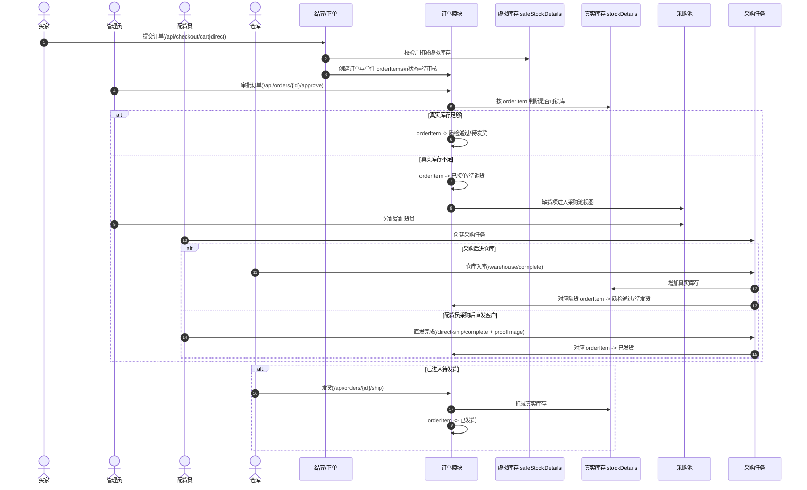

---

## 3. 下单阶段

### 3.1 买家下单

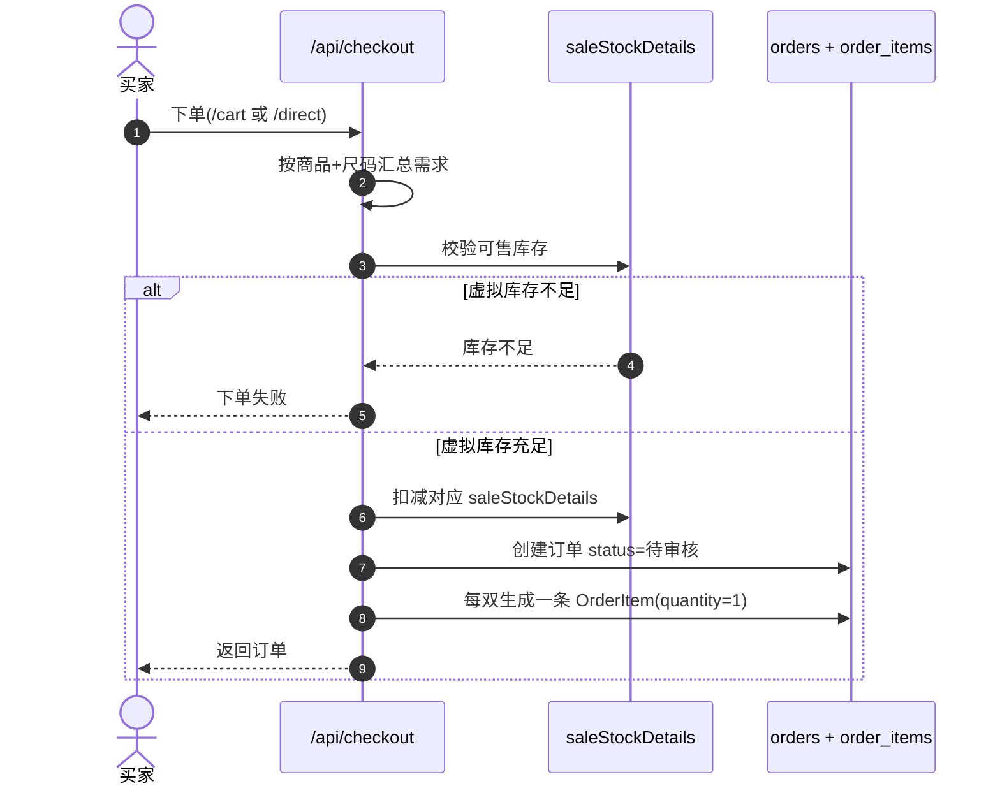

关键点：

- 下单时扣的是虚拟库存，不是真实库存。
- 一双鞋对应一条 `OrderItem`，后续采购、转单、质检、发货都追踪这条 `orderItemId`。

### 3.2 管理员驳回订单

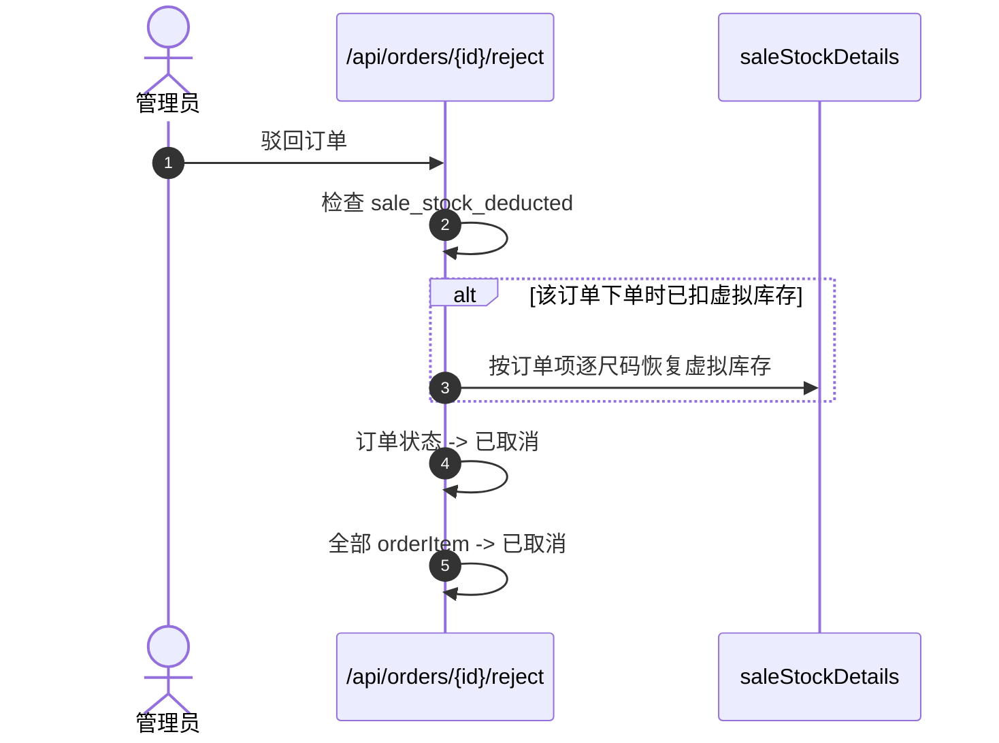

---

## 4. 审批后有货链路

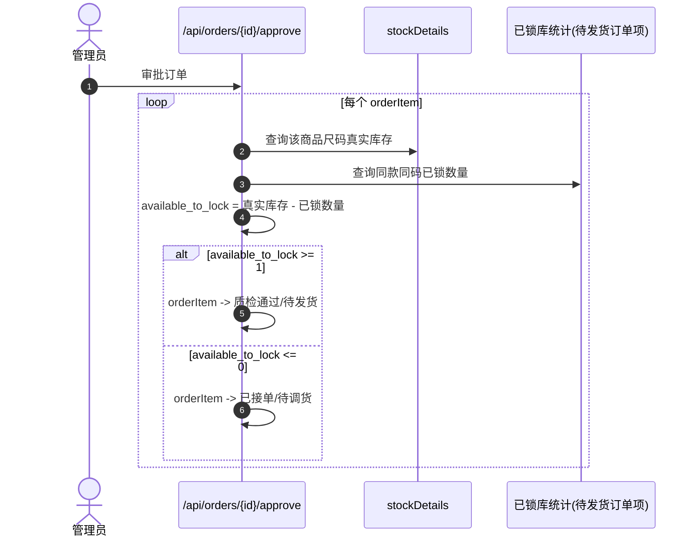

关键点：

- “有货”不代表自动发货，只代表能锁到真实库存。
- 锁库成功后的状态是 `质检通过/待发货`。
- 真正扣真实库存发生在后续发货时，不发生在审批时。

---

## 5. 审批后缺货链路

### 5.1 缺货进入采购池

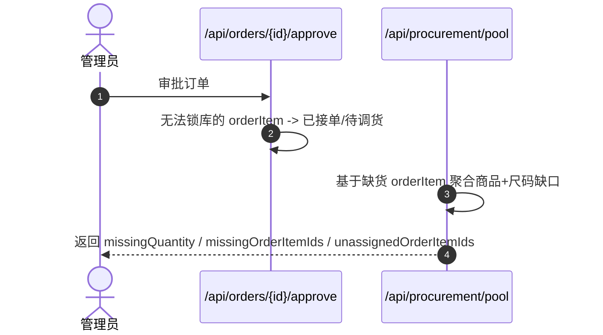

说明：

- 采购池不是单独“入池写表”，而是根据缺货 `orderItem` 实时聚合出来的视图。

### 5.2 管理员分配采购需求

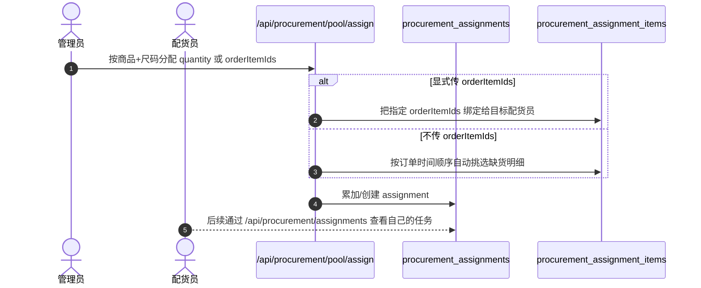

### 5.3 配货员查看自己的分配

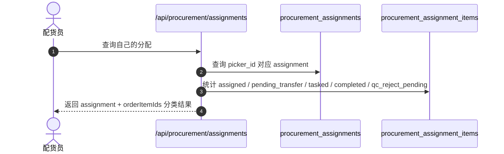

---

## 6. 转单审批链路

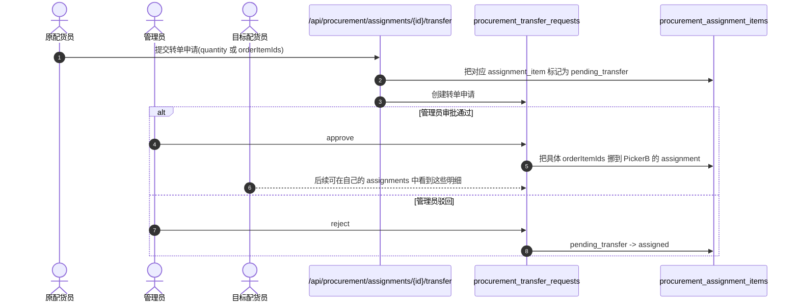

关键点：

- 转单提交后，数量会先被冻结，不允许继续建采购任务。
- 只有审批通过，`orderItemId` 才真正转到别的配货员名下。

---

## 7. 采购任务链路

### 7.1 创建采购任务

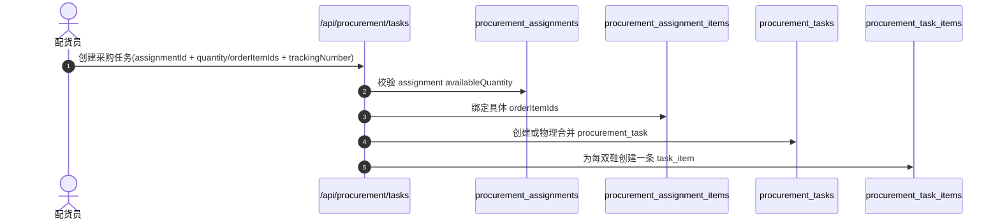

关键点：

- 一个采购任务里仍然是逐双绑定 `orderItemId`。
- 后续仓库入库或直发，都是对这些 `task_items` 按双完成。

---

## 8. 缺货采购后的两条分支

## 8.1 分支 A：采购后进入仓库

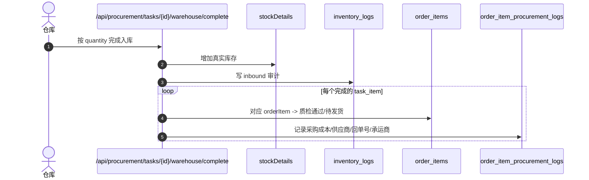

结果：

- 货先进仓库。
- 对应缺货的订单项会被直接锁库，进入 `质检通过/待发货`。
- 后面再由仓库走发货接口。

## 8.2 分支 B：配货员采购后直接发客户（直发）

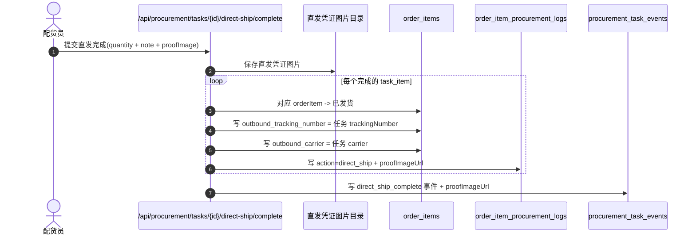

结果：

- 这条链路不经过仓库。
- 不增加真实库存。
- 不扣减真实库存。
- 订单项直接进入 `已发货`。
- 物流信息直接取采购任务的 `trackingNumber` / `carrier`。

---

## 9. 仓库质检不合格池链路

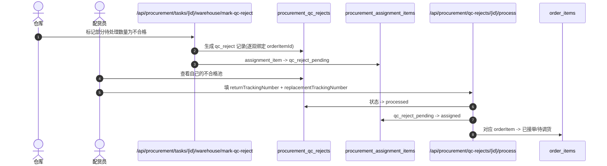

结果：

- 仓库不是直接“退货完成”，而是先打入不合格池。
- 配货员处理完退回单号和新发单号后，这双鞋重新回到正常采购链路。

---

## 10. 仓库发货链路

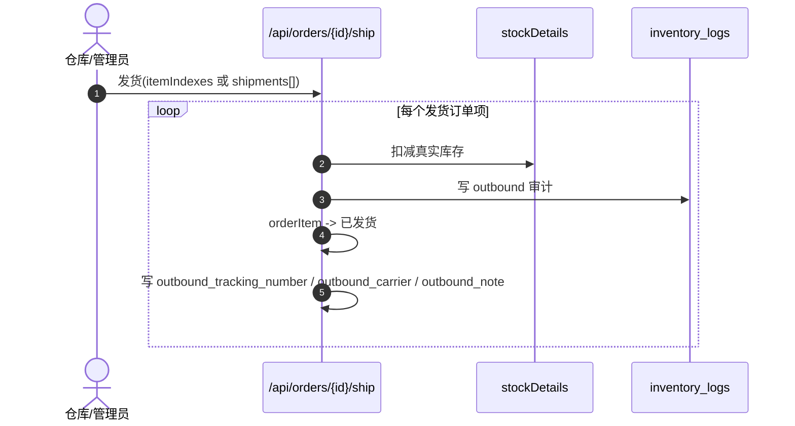

关键点：

- 仓库发货链路只适用于已经是 `质检通过/待发货` 的订单项。
- 如果同一订单 10 双鞋要分 10 个物流单发，后端支持逐双发货。

---

## 11. 撤销发货链路

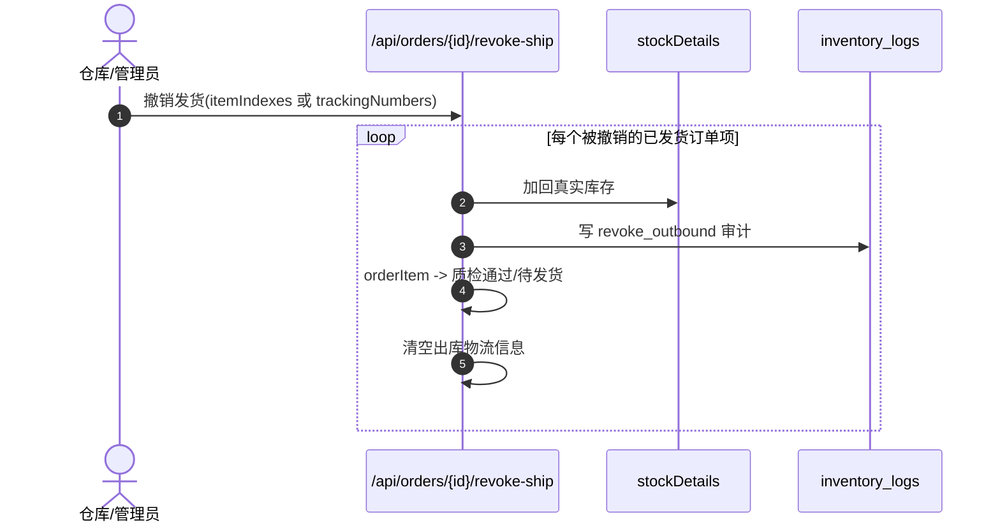

---

## 12. 单双鞋的反查链路

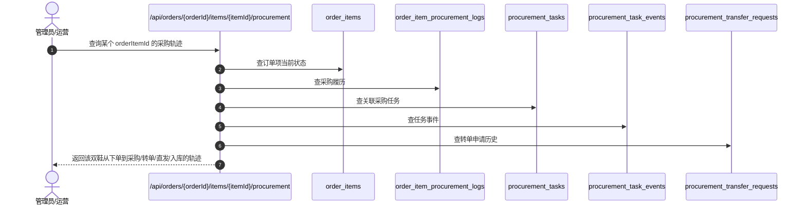

可追踪内容包括：

- 这双鞋有没有缺货
- 分配给了哪个配货员
- 是否发起过转单
- 建过哪个采购任务
- 是仓库入库还是采购直发
- 采购成本、市场价、供应商、结算信息
- 直发凭证图片

---

## 13. 当前逻辑结论

### 13.1 有货

- 下单时只扣虚拟库存。
- 审批后如果真实库存可锁，则进入 `质检通过/待发货`。
- 不会自动发货。
- 后续仍需走仓库发货接口。

### 13.2 没货

- 审批后进入 `已接单/待调货`。
- 采购池按商品+尺码聚合缺口，但底层始终绑定具体 `orderItemId`。
- 后续可以：
  - 采购后进仓库
  - 采购后直发客户

### 13.3 直发

- 直发不是“有货自动发货”。
- 直发是“缺货 -> 进入采购池 -> 建采购任务 -> 配货员采购后直接发客户”的分支。
- 当前正式接口：`POST /api/procurement/tasks/{id}/direct-ship/complete`

